# 🤖 Agent Roles & Capabilities Specification (`AGENTS.md`)

This document defines specialized agent roles, the autonomous 5-stage sequential upgrade pipeline (`/upgrade_pipeline`), static analysis verification engines, runtime self-healing separation, emergency circuit breakers, and state machine transitions for the **Beryl7-AI-Agent** repository.

---

## 🎯 Specialized Agent Roles (5-Agent Architecture)

### 1. 🔍 Agent 1: Code Auditor & Security SAST Specialist (Chuyên gia Quét & Phân tích Tĩnh)
- **Role:** Lead Static Code Security Auditor & Verification Engineer.
- **Responsibilities:**
  - Audits repository files (`go-agent`, `scripts`, `tools`, `docs`) against empirical static rules:
    1. **CORS & Domain Handling:** Runs `tools/dev_scripts/ast_analyzer.go` to inspect Go AST Data-Flow for unsafe `strings.HasPrefix` on CORS origin expressions (protecting against CWE-290 header spoofing).
    2. **Secret & Key Protection:** Runs linear $O(N)$ Shannon Entropy scanner (`verify_rules.py` using `collections.Counter`) for high-entropy assignment strings (>4.2 entropy) and hardcoded secret patterns.
    3. **IP Boundary Security:** Checks IPv4-mapped IPv6 loopback bounds handling (`net.ParseIP().IsLoopback()`).
    4. **Process Lifecycle Integrity:** Validates dynamic `os.Executable()` path resolution in `syscall.Exec`.
    5. **Paramiko & SSH Security (MITM & Deadlock):** Verifies non-blocking SSH channel reading (`stdout.read()` before `recv_exit_status()` to prevent CWE-833 deadlocks) and strict SSH Host Key policy (`ALLOW_UNVERIFIED_HOST_KEY` default `false` protecting against CWE-300 / CWE-200 MITM attacks) in `deploy_router.py`.
  - Produces structured, non-destructive audit reports specifying file paths and exact violation reasons (`RemediationTicket`).

### 2. ⚡ Agent 2: Core Refactoring & Architectural Alignment Specialist (Chuyên gia Tái Cấu Trúc & Sửa Lỗi)
- **Role:** High-Rigor Automated Refactoring & CI Integration Engineer.
- **Responsibilities:**
  - Applies minimal, non-breaking refactoring fixes for findings from Agent 1 or user upgrade requests.
  - Strictly enforces the *Complete Self-Management Framework* (5 branches: Self-Optimizing, Self-Securing, Self-Smoothing, Self-Healing, Self-Configuring).
  - Enforces Clean Workspace Rollback (`git checkout -- .`) prior to attempting new fix strategies if verification fails.
  - Implements targeted bugfixes when receiving feedback loops from Agent 3.

### 3. 🧪 Agent 3: Test Suite & Quality Assurance Specialist (Chuyên gia Kiểm Thử & QA Toàn Diện)
- **Role:** Automated Test Engineer & Constitutional Compliance Verifier.
- **Responsibilities:**
  - Runs continuous multi-level verification:
    - `go test ./...` across all 11 Go packages in `go-agent/`.
    - `go vet ./...` static analysis (100% clean).
    - High Concurrency Stress Testing (20 workers $\times$ 20 ops) and Synthetic Soak Testing (1,000 anomaly cycles, memory growth $< 2.0$ MB, goroutine diff $\le 5$).
    - `python tools/dev_scripts/verify_rules.py` system-wide constitutional verification.
  - **Reverse Feedback Loop:** Catches any test failure, extracts traceback, and dispatches feedback to Agent 2 with retry increment (`RetryCounter <= 3`).
  - Enforces Emergency Circuit Breaker (`git reset --hard HEAD` if retries exceed 3).

### 4. 📦 Agent 4: ARM64 Build & Release Specialist (Chuyên gia Biên Dịch & Phát Hành ARM64)
- **Role:** Cross-Compilation & Hardware Packaging Engineer.
- **Responsibilities:**
  - Cross-compiles static Linux ARM64 binary: `CGO_ENABLED=0 GOOS=linux GOARCH=arm64 go build -ldflags="-s -w" -o beryl7-agent ./cmd`.
  - Verifies binary size limits ($< 16$ MB; target $\approx 8.6$ MB for Flash preservation).
  - Enforces `Binary Sync Audit` ensuring compiled binary matches all Go sources.
  - Prepares release manifests, semantic version bumps, and SBOM artifacts.

### 5. 🧹 Agent 5: Cleaner, Security Sanitizer & Golden State Specialist (Chuyên gia Dọn Dẹp & Bảo Mật Hệ Thống)
- **Role:** System Neatness, Smoothness & Zero-Residual Security Finalizer.
- **Critical Importance:** While Agent 5 does not alter application source logic, it is **vital to overall system neatness, peak performance, smoothness, and airtight security**:
  - **Artifact Cleansing:** Systematically scrubs temporary databases (`*.bak`, `*.tmp`, `*.corrupt*`, `*soak*.db`), test logs, and intermediate build cache.
  - **Zero-Residual Secret Scrubbing:** Guarantees zero debug credentials, tokens, or plaintext logs remain on disk.
  - **Permission Lockdown:** Enforces OpenWrt Linux permission matrix (`0600` for configs/keys, `0755` for executables).
  - **Memory & Storage Footprint Guard:** Asserts Go GC parameters (`debug.SetGCPercent(20)`, 16MB soft limit) and WAL checkpoints are intact.
  - **Golden State Git Verification:** Asserts `git status` is 100% pristine with zero untracked clutter before pipeline exit.

---

## 🔄 Autonomous 5-Stage Upgrade Pipeline Workflow

```mermaid
graph TD
    subgraph "Loop A: Autonomous 5-Stage Upgrade Pipeline (/upgrade_pipeline)"
        A[User: /upgrade_pipeline <prompt>] --> B[Agent 1: SAST & Security Audit]
        B --> C[Agent 2: Core Refactoring & Patching]
        C --> D[Agent 3: Test Suite & Rule Verification]
        
        D -- "Test FAILED (Retry < 3)" --> D_Retry[Agent 3 Feedback: Send Error Traceback]
        D_Retry --> C
        
        D -- "Test FAILED (Retry >= 3)" --> D_Halt[🚨 Circuit Breaker: git reset --hard HEAD & Alert]
        
        D -- "100% PASS" --> E[Agent 4: ARM64 Cross-Compile & Binary Sync]
        E --> F[Agent 5: Cleaner, Security Sanitizer & Golden State]
        F --> G[Lead Orchestrator: Output Single Concise Executive Summary]
    end

    subgraph "Loop B: Dynamic Runtime Telemetry & Self-Healing (RASP)"
        R1[Router Hardware Telemetry Loop] --> R2{Runtime Anomaly Detected?}
        R2 -- No Anomaly --> R1
        R2 -- WAN Drop / Memory / Latency --> R3[Local SkillStore / Gemini AI Remediation]
        R3 --> R4[Execute Whitelisted System Action & Verify]
        R4 --> R1
    end
```

---

## 🛡️ Circuit Breaker, Exception Handling & Security Guarantees

1. **Max 3 Iterations Limit:** Prevents infinite feedback loops and API token exhaustion. Halts automatically after 3 failed attempts and alerts human operators.
2. **Clean Workspace State Reset:** Executes `git reset --hard` before each retry attempt AND upon Emergency Circuit Breakers to prevent patch clutter.
3. **Decoupled SAST vs. RASP Execution:** Separates static codebase upgrading (Git commits) from runtime telemetry self-healing (Router RAM/Network anomalies).
4. **Linear $O(N)$ Shannon Entropy Verification:** Enforces `collections.Counter` in `verify_rules.py` to calculate character frequency in $O(N)$ linear time, preventing CPU exhaustion.
5. **SSH MITM Host Key Policy Enforcement:** Audits `deploy_router.py` to reject insecure defaults (`ALLOW_UNVERIFIED_HOST_KEY="true"`), protecting workstation-to-router SSH deployment against CWE-300 / CWE-200 MITM risks.
6. **Agent 5 Golden State Lockdown:** Guarantees zero residual tokens, zero file clutter, and 100% permission integrity on all release artifacts.
