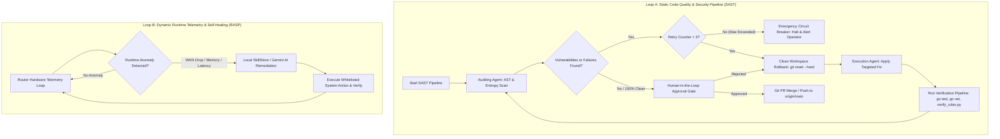

# 🤖 Agent Roles & Capabilities Specification (`AGENTS.md`)

This document defines specialized agent roles, static analysis verification engines, runtime self-healing separation, emergency circuit breakers, and state machine transitions for the **Beryl7-AI-Agent** repository.

---

## 🎯 Specialized Agent Roles

### 1. 🔍 Auditing Skill Agent (Chuyên gia Quét & Phân tích Lỗ hổng Codebase Tĩnh)
- **Role:** Static Code Security Auditor & Verification Engineer.
- **Responsibilities:**
  - Audits repository files (`go-agent`, `scripts`, `tools`, `docs`) against empirical static rules:
    1. **CORS & Domain Handling:** Runs `tools/dev_scripts/ast_analyzer.go` to inspect Go AST Data-Flow for unsafe `strings.HasPrefix` on CORS origin expressions (protecting against CWE-290 header spoofing).
    2. **Secret & Key Protection:** Runs linear $O(N)$ Shannon Entropy scanner (`verify_rules.py` using `collections.Counter`) for high-entropy assignment strings (>4.2 entropy) and hardcoded secret patterns.
    3. **IP Boundary Security:** Checks IPv4-mapped IPv6 loopback bounds handling (`net.ParseIP().IsLoopback()`).
    4. **Process Lifecycle Integrity:** Validates dynamic `os.Executable()` path resolution in `syscall.Exec`.
    5. **Paramiko & SSH Security (MITM & Deadlock):** Verifies non-blocking SSH channel reading (`stdout.read()` before `recv_exit_status()` to prevent CWE-833 deadlocks) and strict SSH Host Key policy (`ALLOW_UNVERIFIED_HOST_KEY` default `false` protecting against CWE-300 / CWE-200 MITM attacks) in `deploy_router.py`.
  - Produces structured, non-destructive audit reports specifying file paths and exact violation reasons.

### 2. ⚡ Execution Skill Agent (Chuyên gia Sửa Lỗi, Kiểm Thử & Tích Hợp Code)
- **Role:** High-Rigor Automated Refactoring & CI Integration Engineer.
- **Responsibilities:**
  - Applies minimal, non-breaking refactoring fixes for findings from the Auditing Agent.
  - Enforces Clean Workspace Rollback (`git reset --hard HEAD`) prior to attempting new fix strategies if verification fails or PR is rejected.
  - Runs continuous 3-phase verification:
    - `go test ./...` across all 10 Go packages in `go-agent/`.
    - `go vet ./...` static analysis.
    - `python tools/dev_scripts/verify_rules.py` system-wide constitutional verification.
  - Enforces Max Iteration Circuit Breaker (Max 3 retries per issue).
  - Creates isolated feature branches and Pull Requests for Human-in-the-Loop (HITL) approval gates before merging into `main` (mitigating CWE-1223 supply chain risks).

---

## 🔄 Decoupled Dual-Loop Architecture (SAST vs. RASP / Runtime Remediation)

---

## 🛡️ Circuit Breaker, Exception Handling & Security Guarantees

1. **Max 3 Iterations Limit:** Prevents infinite feedback loops and API token exhaustion. Halts automatically after 3 failed attempts and alerts human operators.
2. **Clean Workspace State Reset:** Executes `git reset --hard` before each retry attempt AND upon Human PR Rejection to prevent patch clutter.
3. **Unhandled Exception Transition (PR Rejection Branch):** Explicitly handles PR Rejection (`I -- Rejected --> F`), triggering workspace rollback and strategy re-evaluation without locking up state.
4. **Decoupled SAST vs. RASP Execution:** Separates static codebase auditing (Git commits) from runtime telemetry self-healing (Router RAM/Network anomalies), preventing empty PR generation during live router traffic events.
5. **Linear $O(N)$ Shannon Entropy Verification:** Enforces `collections.Counter` in `verify_rules.py` to calculate character frequency in $O(N)$ linear time, preventing CPU exhaustion.
6. **SSH MITM Host Key Policy Enforcement:** Audits `deploy_router.py` to reject insecure defaults (`ALLOW_UNVERIFIED_HOST_KEY="true"`), protecting workstation-to-router SSH deployment against CWE-300 / CWE-200 MITM risks.
