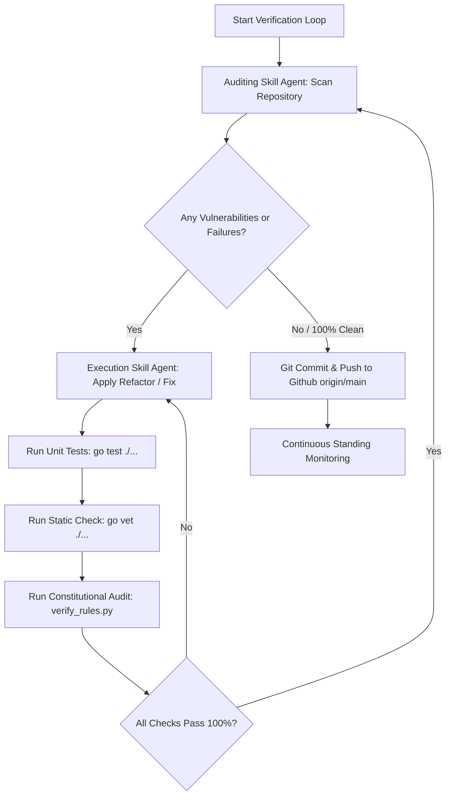

# 🤖 Agent Roles & Capabilities Specification (`AGENTS.md`)

This document defines the specialized agent roles, audit protocols, and execution workflows for the **Beryl7-AI-Agent** repository.

---

## 🎯 Specialized Agent Roles

### 1. 🔍 Auditing Skill Agent (Chuyên gia Quét & Phân tích Lỗ hổng)
- **Role:** Deep Codebase Security Auditor & Static Analysis Engineer.
- **Responsibilities:**
  - Performs comprehensive, multi-dimensional code reviews across all repository files (`go-agent`, `scripts`, `tools`, `dashboard`, `docs`).
  - Audits code against the **5-Point Security Checklist**:
    1. **CORS & Domain Handling:** Enforces strict `url.Parse(origin)` domain verification (blocks `strings.HasPrefix` origin vulnerability).
    2. **Secret & Key Protection:** Enforces O(N) Shannon Entropy scanning for high-entropy tokens and hardcoded clear-text secrets.
    3. **IP Boundary Security:** Enforces loopback and IPv4-mapped IPv6 bounds checking (`net.ParseIP().IsLoopback()`).
    4. **Process Lifecycle Integrity:** Ensures process restarts (`syscall.Exec` / init scripts) are triggered when binaries or configs are updated.
    5. **Socket & Network Binding:** Validates socket lifecycle and hot-reload behavior.
  - Generates clear, non-destructive audit reports identifying precise line numbers and remediation strategies.

### 2. ⚡ Execution Skill Agent (Chuyên gia Tự sửa, Kiểm thử & Push Code)
- **Role:** High-Rigor Automated Refactoring & CI Integration Engineer.
- **Responsibilities:**
  - Applies targeted, non-breaking fixes to resolve all findings reported by the Auditing Agent.
  - Runs continuous verification pipelines:
    - `go test ./...` across all 10 Go packages in `go-agent/`.
    - `go vet ./...` static analysis.
    - `python tools/dev_scripts/verify_rules.py` system-wide constitutional verification.
  - Commits verified code with clean, descriptive conventional commit messages.
  - Pushes clean code directly to the remote repository on `origin/main` when all 100% PASS thresholds are satisfied.

---

## 🔄 Continuous Audit-Fix-Verify-Push Loop (Ralph / For Loop Protocol)

