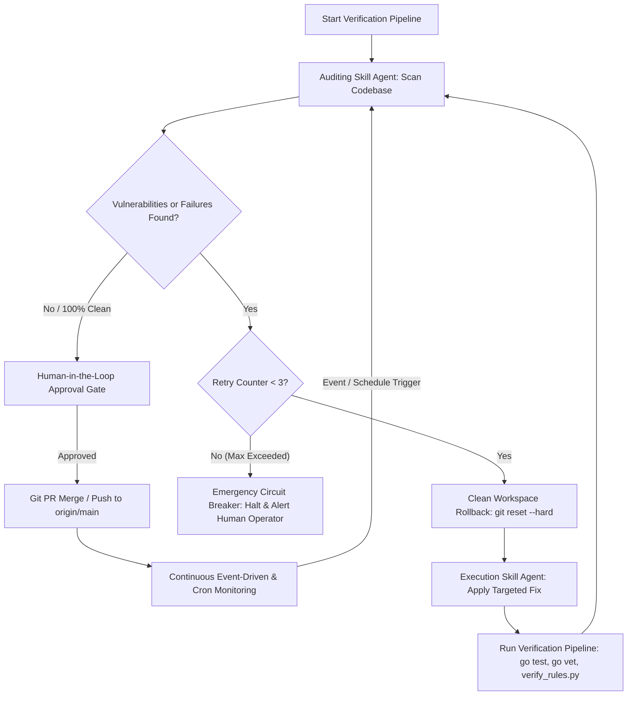

# 🤖 Agent Roles & Capabilities Specification (`AGENTS.md`)

This document defines the specialized agent roles, audit protocols, emergency circuit breakers, and verification workflows for the **Beryl7-AI-Agent** repository.

---

## 🎯 Specialized Agent Roles

### 1. 🔍 Auditing Skill Agent (Chuyên gia Quét & Phân tích Lỗ hổng)
- **Role:** Static Analysis Auditor & Code Quality Verifier.
- **Responsibilities:**
  - Audits repository files (`go-agent`, `scripts`, `tools`, `dashboard`, `docs`) against empirical static rules:
    1. **CORS & Domain Handling:** Scans Go AST AST-Flow (`ast_analyzer.go`) for unsafe `strings.HasPrefix` on origin string expressions.
    2. **Secret & Key Protection:** Runs linear O(N) Shannon Entropy scanner (`verify_rules.py`) for high-entropy assignment strings (>4.2 entropy) and plaintext password regex patterns.
    3. **IP Boundary Security:** Checks IPv4-mapped IPv6 loopback bounds handling (`net.ParseIP().IsLoopback()`).
    4. **Process Lifecycle Integrity:** Validates dynamic `os.Executable()` path resolution in `syscall.Exec`.
    5. **Paramiko & SSH Security:** Verifies non-blocking SSH channel reading (`stdout.read()` before `recv_exit_status()`) to prevent CWE-833 deadlocks.
  - Produces structured, non-destructive audit reports specifying file paths and exact violation reasons.

### 2. ⚡ Execution Skill Agent (Chuyên gia Sửa Lỗi, Kiểm Thử & Tích Hợp Code)
- **Role:** High-Rigor Automated Refactoring & Verification Engineer.
- **Responsibilities:**
  - Applies minimal, non-breaking refactoring fixes for findings from the Auditing Agent.
  - Enforces Clean Workspace Rollback (`git reset --hard HEAD`) prior to attempting new fix strategies if verification fails.
  - Runs continuous 3-phase verification:
    - `go test ./...` across all 10 Go packages in `go-agent/`.
    - `go vet ./...` static analysis.
    - `python tools/dev_scripts/verify_rules.py` system-wide constitutional verification.
  - Enforces Max Iteration Circuit Breaker (Max 3 retries per issue).
  - Creates isolated feature branches and Pull Requests with Human-in-the-Loop (HITL) approval gates before merging into `main` (mitigating CWE-1223 supply chain risks).

---

## 🔄 Bounded Audit-Fix-Verify-Monitor Architecture (Ralph / Event-Driven Protocol)

---

## 🛡️ Circuit Breaker & Safety Guarantees

1. **Max 3 Iterations Limit:** Prevents infinite feedback loops and API token exhaustion. Halts automatically after 3 failed attempts and alerts human operators.
2. **Clean Workspace State Reset:** Executes `git reset --hard` before each retry attempt to prevent patch clutter and dirty state accumulation.
3. **Human-in-the-Loop Security Gate:** Blocks direct unvetted pushes to `main` branch to prevent CWE-1223 supply chain vulnerabilities.
4. **Event-Driven Continuous Loop:** Connects monitoring output back to the auditing scanner upon runtime telemetry anomalies or scheduled cron triggers.
