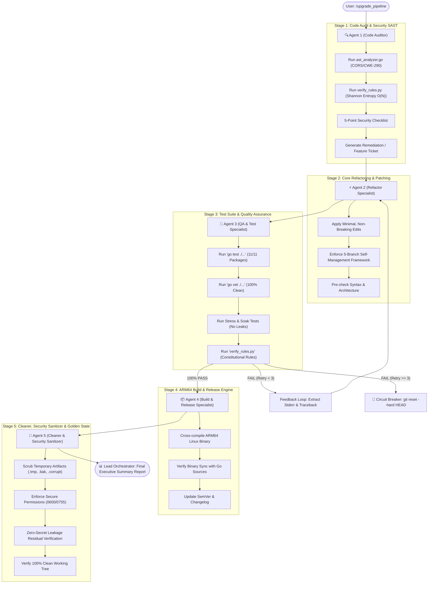

# 🚀 Autonomous 5-Stage Upgrade Pipeline (`/upgrade_pipeline`)

This skill defines the permanent, end-to-end automated pipeline for upgrading, refactoring, and maintaining the **Beryl7-AI-Agent** codebase.

When invoked via `/upgrade_pipeline [nội dung cần nâng cấp/sửa đổi]`, the **Lead Orchestrator (Agent 1)** coordinates a sequential, 5-stage background execution chain. All intermediate logs remain internal, and only the final concise executive report is output to the user.

---

## 🔁 5-Stage Sequential Execution Chain



---

## 🛡️ Stage-by-Stage Roles & Responsibilities

### 🔍 Stage 1: Agent 1 — Code Audit & Security SAST
- **Goal:** Static codebase analysis, vulnerability detection, and scope definition.
- **Actions:**
  1. Parse Go AST data flow via `tools/dev_scripts/ast_analyzer.go` to ensure strict host/origin validation (CWE-290).
  2. Run linear $O(N)$ Shannon Entropy scanner via `tools/dev_scripts/verify_rules.py` for credential leakage.
  3. Validate 5-point security checklist (CORS, Zero Hardcoded Secrets, IPv4/IPv6 loopback, dynamic `os.Executable()`, Paramiko non-blocking I/O).
  4. Package findings and user instructions into a structured `RemediationTicket`.

### ⚡ Stage 2: Agent 2 — Core Refactoring & Patching
- **Goal:** Precise, minimal, non-breaking codebase modification.
- **Actions:**
  1. Implement requested changes or fixes in `go-agent/`.
  2. Maintain compliance with the *Complete Self-Management Framework* (Self-Optimizing, Self-Securing, Self-Smoothing, Self-Healing, Self-Configuring).
  3. Guarantee zero disruption to existing OpenWrt hardware features (MediaTek Filogic 820 ARM64, MT7993 Wi-Fi 7).

### 🧪 Stage 3: Agent 3 — Test Suite, Stress & Verification
- **Goal:** Automated empirical verification across all 11 Go packages.
- **Actions:**
  1. Execute `go test -v ./...` across: `ai`, `cmd`, `config`, `executor`, `logger`, `notifier`, `orchestrator`, `parser`, `skillstore`, `telemetry`, `tests`, `watchdog`.
  2. Execute `go vet ./...` (must be 100% clean).
  3. Execute High Concurrency Stress Test (20 workers $\times$ 20 ops) and Synthetic Soak Test (1,000 anomaly cycles, memory growth $< 2.0$ MB, goroutine diff $\le 5$).
  4. Run `python tools/dev_scripts/verify_rules.py`.
  - **Reverse Feedback Loop:** If any check fails, extract failure details and send feedback back to Agent 2 with `RetryCounter = RetryCounter + 1` (Max 3 retries). If exceeded 3 retries, trigger `git reset --hard HEAD` and halt.

### 📦 Stage 4: Agent 4 — Build & Release Engineering
- **Goal:** Production ARM64 artifact generation and compatibility audit.
- **Actions:**
  1. Build static ARM64 binary: `CGO_ENABLED=0 GOOS=linux GOARCH=arm64 go build -ldflags="-s -w" -o beryl7-agent ./cmd`.
  2. Verify binary size is within router flash envelope ($< 16$ MB; target $\approx 8.6$ MB).
  3. Run `Binary Sync Audit` to confirm the compiled binary is newer than all `.go` sources.

### 🧹 Stage 5: Agent 5 — Cleaner, Security Sanitizer & Golden State Finalizer *(CRITICAL)*
- **Goal:** System neatness, zero clutter, peak smoothness, and zero-residual security.
- **Actions:**
  1. **Artifact Purge:** Remove all `.tmp`, `.bak`, `.corrupt`, `.coverage`, and orphaned debug logs.
  2. **Zero-Secret Scrubbing:** Scan filesystem to ensure no debug tokens, temporary keys, or unredacted test logs remain on disk.
  3. **File Permission Lockdown:** Enforce strict permission matrix (`/etc/beryl7/agent.env` $\rightarrow$ `0600`, `/etc/beryl7/agent.key` $\rightarrow$ `0400`, `/usr/bin/beryl7-agent` $\rightarrow$ `0755`, `/etc/init.d/beryl7-agent` $\rightarrow$ `0755`, `/root/skills.db` $\rightarrow$ `0600`).
  4. **Working Tree Golden State:** Run `git status --porcelain` to verify working tree is 100% pristine with no untracked clutter.

---

## 📊 Final Output Format (Presented to User)

Upon pipeline completion, Lead Orchestrator renders the single final summary in this exact format:

```markdown
# ✅ BERYL 7 AUTONOMOUS UPGRADE PIPELINE: COMPLETED

### 📋 Executive Summary
- **Mục tiêu thực hiện:** [Nội dung yêu cầu]
- **Trạng thái Pipeline:** 100% SUCCESS (Passed all 5 Stages)
- **Số vòng thử nghiệm (Retries):** [0 / Max 3]

### 🔍 Kết Quả 5 Giai Đoạn:
1. **Agent 1 (Code Audit):** [Tóm tắt kết quả quét SAST / 0 lỗ hổng mới]
2. **Agent 2 (Refactor):** [Danh sách file đã cập nhật / tính năng đã thêm]
3. **Agent 3 (Test Suite):** 11/11 Go Packages PASS | 100% Clean `go vet` | Soak/Stress PASS
4. **Agent 4 (ARM64 Build):** Binary ARM64 compiled ([X.X] MB) | Binary Sync PASS
5. **Agent 5 (Cleaner & Security):** Workspace 100% Clean | Permissions Verified | 0 Secret Residue

### 🚀 Trạng thái sẵn sàng:
Router daemon đã sẵn sàng triển khai (`deploy_router.py`) hoặc nạp vào production.
```
