# 🔄 Autonomous 5-Stage Upgrade Pipeline Workflow Specification

This document defines the automated, fault-tolerant 5-stage pipeline for the **Beryl7-AI-Agent** repository.

---

## 🎯 High-Level Pipeline Architecture

The pipeline ensures high-rigor engineering, complete self-management compliance, automated verification, and clean workspace security whenever an upgrade or bugfix is executed via `/upgrade_pipeline`.

```mermaid
stateDiagram-v2
    [*] --> Stage1_Audit: /upgrade_pipeline <prompt>
    
    state Stage1_Audit {
        [*] --> AST_DataFlow_Scan
        AST_DataFlow_Scan --> Shannon_Entropy_Scan
        Shannon_Entropy_Scan --> FivePoint_Security_Check
        FivePoint_Security_Check --> Generate_Remediation_Ticket
    }
    
    Stage1_Audit --> Stage2_Refactor: Remediation Ticket
    
    state Stage2_Refactor {
        [*] --> Apply_Minimal_Patches
        Apply_Minimal_Patches --> Self_Management_Alignment
        Self_Management_Alignment --> Precheck_Syntax
    }
    
    Stage2_Refactor --> Stage3_Verify: Code Changes Applied
    
    state Stage3_Verify {
        [*] --> Go_Test_11_Packages
        Go_Test_11_Packages --> Go_Vet_Analysis
        Go_Vet_Analysis --> Stress_And_Soak_Tests
        Stress_And_Soak_Tests --> Constitutional_Rule_Verification
    }
    
    Stage3_Verify --> Stage2_Refactor: Test Failure (Retry < 3)
    Stage3_Verify --> Emergency_Rollback: Test Failure (Retry >= 3)
    Stage3_Verify --> Stage4_Release: 100% Pass
    
    state Stage4_Release {
        [*] --> Cross_Compile_ARM64
        Cross_Compile_ARM64 --> Verify_Binary_Sync
        Verify_Binary_Sync --> SemVer_And_Changelog
    }
    
    Stage4_Release --> Stage5_Cleaner: Binary Ready
    
    state Stage5_Cleaner {
        [*] --> Scrub_Temporary_Files
        Scrub_Temporary_Files --> Enforce_File_Permissions
        Enforce_File_Permissions --> Zero_Secret_Residue_Scan
        Zero_Secret_Residue_Scan --> Golden_State_Git_Verify
    }
    
    Stage5_Cleaner --> Completed_Summary: All 5 Stages Clean
    Completed_Summary --> [*]
    Emergency_Rollback --> [*]: Workspace Restored via git reset --hard
```

---

## 🛡️ Special Emphasis on Stage 5: Cleaner, Security Sanitizer & Golden State Finalizer

Stage 5 is **critical to the entire system lifecycle**, governing system smoothness, zero latency degradation, memory leak prevention, and zero-residual security:

1. **Neatness & Storage Footprint:**
   - OpenWrt routers possess strictly bounded flash partitions (16MB to 32MB storage).
   - Agent 5 systematically deletes all temporary test databases (`*.db.bak`, `*.corrupt*`, `*soak*.db`), scratch scripts, and coverage files.
2. **Zero-Residual Security:**
   - Any temporary debug tokens, test certificates, or environment overrides created during testing are scrubbed.
   - Restores and verifies Linux file permission matrix (`0600` for configs/keys, `0755` for executables).
3. **Execution Smoothness & Memory Footprint:**
   - Asserts that Go GC parameters (`debug.SetGCPercent(20)`, 16MB soft limit) and SQLite WAL checkpoint states are preserved.
4. **Git Repository Golden State:**
   - Verifies `git status` reports 0 untracked trash files, preventing supply-chain pollution.

---

## 🔁 Complete Reverse Recovery & Circuit Breaker Logic

| Stage | Failure Event | Autonomous Recovery Action | Hard Halt Condition |
| :--- | :--- | :--- | :--- |
| **Stage 1 (Audit)** | Unsafe CORS pattern, hardcoded key, or AST parse error | Packages issue into `RemediationTicket` for Agent 2 | Corrupted core tree $\rightarrow$ Halt & alert operator |
| **Stage 2 (Refactor)** | Merge conflict or Go syntax error | `git checkout -- .` and attempt alternative patch | 3 consecutive patch failures $\rightarrow$ Rollback & halt |
| **Stage 3 (Verify)** | `go test` fail, `go vet` lint, soak leak, or `verify_rules.py` fail | Extracts failure log $\rightarrow$ feedback to Agent 2 (`Retry++`) | `Retry >= 3` $\rightarrow$ `git reset --hard HEAD` & halt |
| **Stage 4 (Build)** | Linker error, CGO failure, or binary size $> 16$ MB | Clean cache (`go clean -cache`), adjust `-ldflags="-s -w"` | Persistent compiler failure $\rightarrow$ Rollback & alert |
| **Stage 5 (Clean)** | Locked files or residual artifacts | Safe Force Cleanup, unbind locked handles | Residual sensitive files $\rightarrow$ Quarantine & alert |
