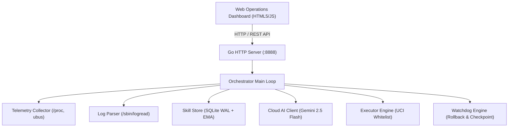

# System Architecture & Component Specification 🏗️

System: **Beryl 7 AI Agent**  
Document Version: **v1.0.0**

---

## 1. C4 Component Architecture

---

## 2. Core Architecture Modules

1. **Orchestrator Loop:** 5-second priority loop gating telemetry collection, log pattern scanning, and AI evaluation.
2. **Telemetry Collector:** Native parser for `/proc/stat`, `/proc/meminfo`, `/proc/net/dev`, `/proc/net/nf_conntrack_count`, `/proc/net/arp`, and `ubus`.
3. **Skill Store:** SQLite WAL database with Exponential Moving Average (EMA) learning for instant sub-millisecond local remediation.
4. **Cloud AI Client:** Gemini 2.5 Flash API client with structured JSON parsing and fallback.
5. **Executor Engine:** Non-shell isolated UCI configuration applier with strict parameter whitelisting.
6. **Watchdog Engine:** Selective UCI checkpointing, pre-check syntax validation, and automatic WAN failure rollback.
