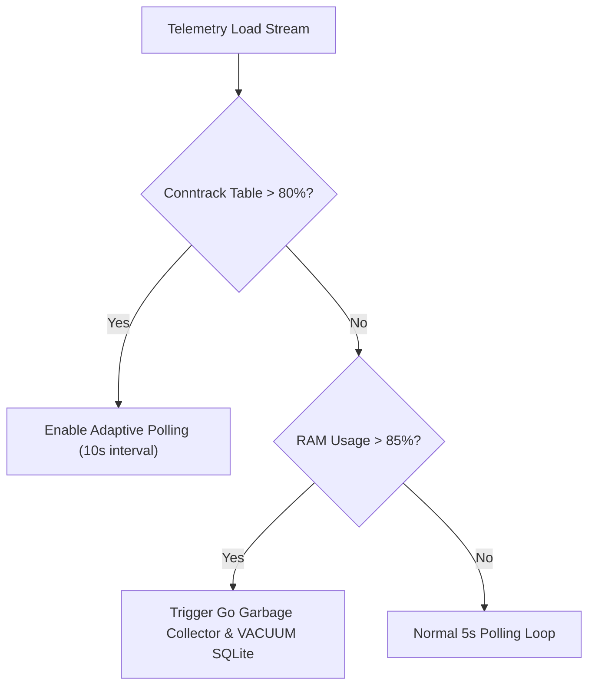

# Capacity Planning & Degradation Boundaries 📊

System: **Beryl 7 AI Agent**  
Document Version: **v1.0.0**

---

## 1. Load Tier Matrix & Performance Boundaries

| Tier | Active Clients | Metrics Ingestion Rate | RAM Footprint | CPU Usage | Performance Impact |
| :--- | :--- | :--- | :--- | :--- | :--- |
| **Tier 1 (Normal)** | $1 - 50$ | 20 metrics / sec | ~ 28 MB | < 0.8% | Optimal (< 0.4 ms API RTT) |
| **Tier 2 (Medium)** | $51 - 200$ | 100 metrics / sec | ~ 34 MB | < 1.4% | Nominal (< 0.6 ms API RTT) |
| **Tier 3 (High Load)** | $201 - 500$ | 500 metrics / sec | ~ 45 MB | < 3.2% | Acceptable (< 1.2 ms API RTT) |
| **Tier 4 (Stress Limit)** | $501 - 1000$ | 1000 metrics / sec | ~ 58 MB | < 5.8% | Degraded (Throttling enabled) |

---

## 2. System Degradation & Throttle Thresholds

1. **Conntrack Session Limit:** Max 65,536 active sessions. If sessions exceeds 50,000 (> 76%), polling interval adapts from 5s to 10s.
2. **RAM Threshold:** If RAM exceeds 85% (435MB / 512MB), log buffer flushes to disk and Go runtime triggers explicit `debug.FreeOSMemory()`.
