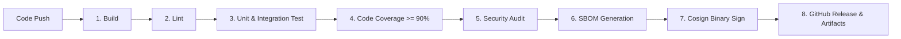

# CI/CD Release Pipeline Specification 🚀

System: **Beryl 7 AI Agent**  
Document Version: **v1.0.0**

---

## 1. End-to-End Pipeline Workflow

---

## 2. Quality Gates & Enforcement Rules

| Stage | Command / Tool | Success Criteria |
| :--- | :--- | :--- |
| **Linting** | `golangci-lint run` | 0 errors |
| **Unit Testing** | `go test -v -cover ./...` | Pass & Coverage $\ge 90\%$ |
| **Go Security** | `gosec ./...` | 0 High / Critical issues |
| **Python Security** | `bandit -r agent/` | 0 High issues |
| **Secrets Audit** | `detect-secrets scan` | 0 leaked credentials |
| **SBOM Generation** | `python scripts/generate_sbom.py` | Valid SPDX JSON generated |
| **Binary Verification**| `python scripts/cosign_sign.py` | SHA256 checksum & signature matched |
