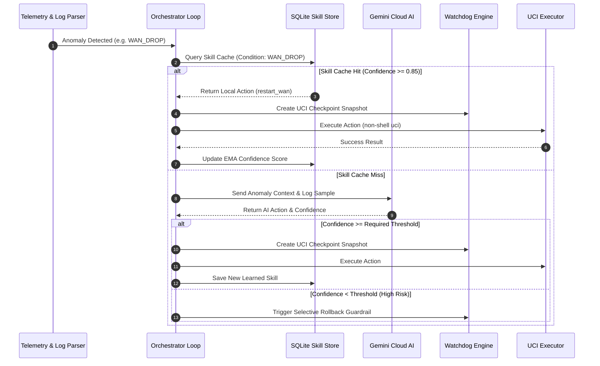

# System Sequence Diagrams 🔄

System: **Beryl 7 AI Agent**  
Document Version: **v1.0.0**

---

## 1. Autonomous Remediation Flow Sequence

```mermaid
sequenceDiagram
    autonumber
    participant Telemetry as Telemetry & Log Parser
    participant Orchestrator as Orchestrator Loop
    participant SkillStore as SQLite Skill Store
    participant CloudAI as Gemini Cloud AI
    participant Watchdog as Watchdog Engine
    participant Executor as UCI Executor

    Telemetry->>Orchestrator: Anomaly Detected (e.g. WAN_DROP)
    Orchestrator->>SkillStore: Query Skill Cache (Condition: WAN_DROP)
    alt Skill Cache Hit (Confidence >= 0.85)
        SkillStore-->>Orchestrator: Return Local Action (restart_wan)
        Orchestrator->>Watchdog: Create UCI Checkpoint Snapshot
        Orchestrator->>Executor: Execute Action (non-shell uci)
        Executor-->>Orchestrator: Success Result
        Orchestrator->>SkillStore: Update EMA Confidence Score
    else Skill Cache Miss
        Orchestrator->>CloudAI: Send Anomaly Context & Log Sample
        CloudAI-->>Orchestrator: Return AI Action & Confidence
        alt Confidence >= Required Threshold
            Orchestrator->>Watchdog: Create UCI Checkpoint Snapshot
            Orchestrator->>Executor: Execute Action
            Orchestrator->>SkillStore: Save New Learned Skill
        else Confidence < Threshold (High Risk)
            Orchestrator->>Watchdog: Trigger Selective Rollback Guardrail
        end
    end
```
