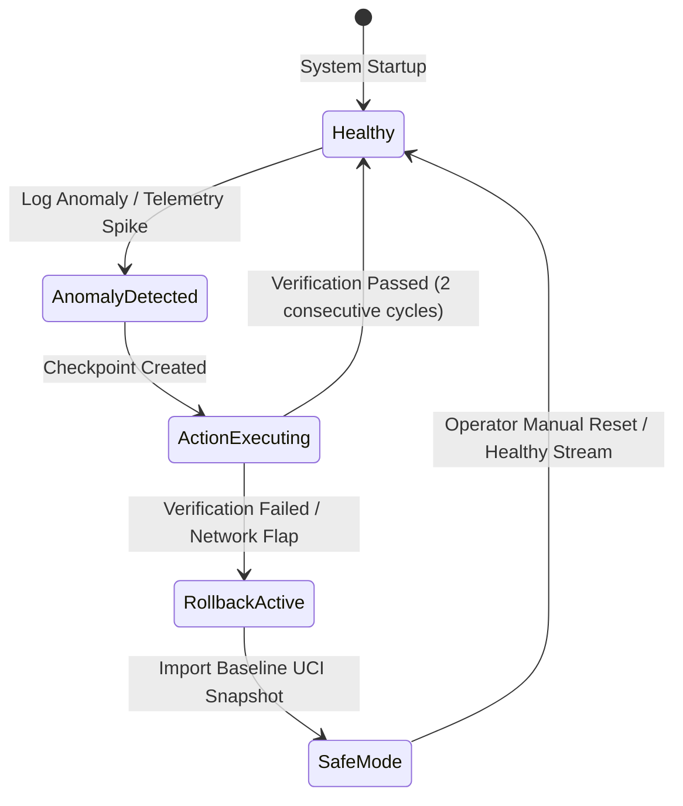

# Watchdog State Machine Specification 🔄

System: **Beryl 7 AI Agent**  
Document Version: **v1.0.0**

---

## 1. Watchdog State Transition Diagram

```mermaid
stateDiagram-v2
    [*] --> Healthy : System Startup
    Healthy --> AnomalyDetected : Log Anomaly / Telemetry Spike
    AnomalyDetected --> ActionExecuting : Checkpoint Created
    ActionExecuting --> Healthy : Verification Passed (2 consecutive cycles)
    ActionExecuting --> RollbackActive : Verification Failed / Network Flap
    RollbackActive --> SafeMode : Import Baseline UCI Snapshot
    SafeMode --> Healthy : Operator Manual Reset / Healthy Stream
```
